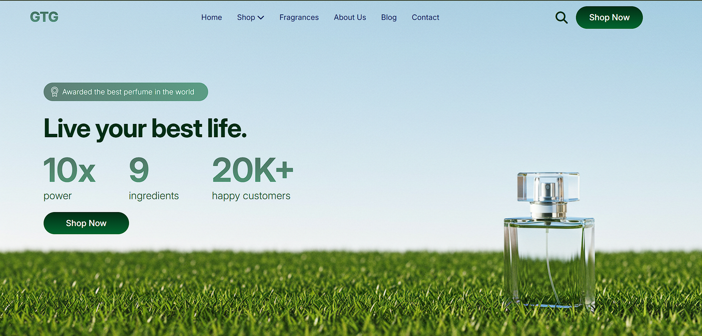

# Hi, I'm Aboobacker Rikkas

**Full-Stack Python Developer | API & Dashboard Specialist**

---

## Professional Summary
Full-Stack Python Developer with hands-on experience building scalable web applications using **Flask, Vue.js, and MySQL**. Delivered production-ready systems with 99% bug-free performance and zero downtime during internal evaluations. Built an enterprise-grade **HR Management System** handling 100+ employee records with real-time synchronization and 98% payroll accuracy. Skilled in REST APIs, responsive UI, authentication, deployment, debugging, and Agile workflows.

---

## Technical Skills

### Languages & Frameworks
- Python, JavaScript (ES6)
- Flask, Vue.js, jQuery, HTML5, CSS3

### Backend & APIs
- RESTful API Development
- CRUD Operations
- CORS, Axios Integration
- Authentication & Authorization
- Role-Based Access Control (RBAC)

### Database
- MySQL
- Database Design & Query Optimization

### Tools & Platforms
- Git, GitHub (50+ commits)
- Postman
- VS Code
- Vercel, Render

---

## Projects

### HR Management Web Application
**Tech:** Flask | Vue.js | MySQL | Axios | RBAC | CORS  
- Supports 100+ employee records with full CRUD operations and real-time data sync  
- Separate Admin and Employee dashboards validated by 15+ internal users  
- Modules include Payroll Processing, Leave Management, Meetings, Events, and Analytics  
- Reduced manual data entry time by 30% using automation  
- Achieved 98% accuracy in payroll calculations during evaluation  

---

### Personal Portfolio Website
**Tech:** Flask | HTML | CSS | JavaScript | Resend API  
- Responsive portfolio showcasing projects, skills, and certifications  
- Contact form integrated with Flask backend using Resend API for email delivery  
- Optimized for SEO, smooth navigation, and cross-device compatibility  

## Live Links
- Personal Portfolio: [Open Portfolio](https://portfolio-ivory-kappa-61.vercel.app/)

**Screenshots:**  

---

### GTG Perfume E-Commerce Website
**Tech:** HTML | CSS | JavaScript  
- Built responsive, mobile-first product interface  
- Implemented checkout response handling and client-side validation  
- Optimized UI for fast loading and seamless browsing on all devices  

## Live Links
- HR App Demo: [Open HR App](https://cube-assignment-six.vercel.app/)

**Screenshot:**  

---

## Education
- **Python Full-Stack Development Course**  
  *Kuniya Institute of Computer Education* (May 2024 – Aug 2025)

---

## Certifications
- Python Programming
- Web Designing
- SQL Fundamentals

---

## Contact
- **Email:** aboobackerrikkasofficial@gmail.com
- **LinkedIn:** linkedin.com/in/aboobacker-rikkas
- **GitHub:** github.com/aboobackerrikkasofficial-cell
- **Location:** Kasaragod, Kerala, India

---

---

## GitHub Stats

  
  

  

    

---

## Profile Badges

  
  
  

---

## Tech Stack Badges

  
  
  
  
  
  
  

---

## Social & Portfolio

  
  
  

---

### Profile Views

